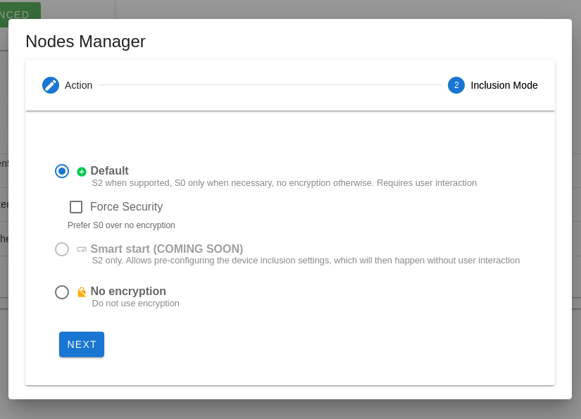

# Nodes Management

Nodes can be managed from Control Pannel page by clicking on `MANAGE NODES` button under `Actions` section. This will open the **Nodes Manager** dialog

## Add a node

1. Select `Inclusion` and press `NEXT`
2. Select the inclusion Mode (we suggest to use `Default` or `Smart start`) and press `NEXT`
3. Put your device in `Inclusion mode` (check your device manual)
4. If the selected mode is `Default` next steps depends on the device you are including, if it supports S0/S2 security you will be asked to select the security classes to grant and, if the device requires it, the DSK pin code. If all the process completes without errors you will see a message saying the node has been added and the security class used.

## Remove a node

1. Select `Exclusion` and press `NEXT`
2. Put your device in `Exclusion mode` (check your device manual)
3. If the process completes without errors you will see a message saying the node has been removed successfully

## Replace failed node

Like `Remove Failed Node`, this can only succeed if the node to replace:

- is marked as **Dead** or **Asleep**
- does not respond to a ping

1. Select `Replace Failed Node` and press `NEXT`
2. Select the node you want to replace in the dropdown menu, if the node is not listed you can manually write the node id there. Once done press `NEXT`
3. Select the inclusion mode. If your device supports it prefer S2 security, if not use no encryption. Use S0 security only if really needed (for example for old lock devices)
4. Put your device in `Inclusion mode` (check your device manual)
5. If the selected mode is `S2` in the next steps you will be asked to select the security classes to grant and the DSK pin code. If all the process completes without errors you will see a message saying the node has been added and the security class used.

## Example

