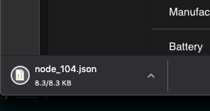

# Bug Report

When something isn't working as expected you should [open an issue](https://github.com/zwave-js/zwavejs2mqtt/issues/new/choose) on Github. To help us debugging your issue you should provide some additional informations like logs and node export if needed.

## Export Logs

The are two main loggers, one for zwavejs2mqtt and one for zwave-js module.

To help us finding what's going on, when reporting a bug, you should attach the logs coming from both loggers.

Both loggers options are configurable from the UI in `Settings`:

1. The ZwaveJS logger can be confgured in `Zwave` section, enable `Log enabled` switch and `Log To File` and set `Log Level` to `silly`
2. The zwavejs2mqtt logger can be confgured in `General` section, enable `Log enabled` switch and `Log To File` and set `Log Level` to `silly`

Now press on `SAVE` button to store the new settings and your logs will be stored in separeted files inside `store` folder. The zwavejs2mqtt log output file will be named `zwavejs2mqtt.log` and the zwavejs one `zwavejs_<processid>.log`

You can easily download a zip with this logs files from the `Explorer` view on the UI. Just select the files you want to export, press on the fab button on the bottom right corner and press the download icon. Remember to attach the zip to your issue.

## Export node.json

Each node hass an Export button, this will export all data of this specific node. To perform this export, use our screen shots and steps as your guide.

1. Select node from the web ui
   

   Will result showing you more details of the node at the bottom of your interface.

   

2. Export Node json by clicking on export shown on screenshot! this will generate a json of this specific node.

   

3. Grab the file and attach it on your github Issue

   

This is useful mostly when there are issue with hass discovery of values of this node.
