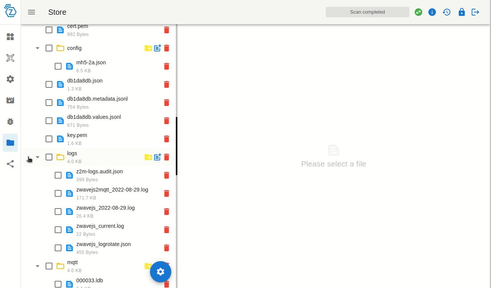

# Generating Log Files

The are two main loggers, one for ZWavejs2Mqtt and one for the Z-Wave JS module. Logs are necessary to diagnose almost all issues.

Both logger options are configured from the `Settings` page.

## Application logs

> [!NOTE]
> Application logs are of limited utility and are only useful for diagnosing **errors in the UI itself**, versus lower-level Z-Wave network operations that are reflected in the driver logs.

ZWavejs2Mqtt logger can be configured in `General` section, enable `Log enabled` switch and `Log To File` and set `Log Level` to `Silly`

> Log file name: `zwavejs2mqtt.log`

## Driver logs

> [!NOTE]
> Driver logs are required for all issues that are not purely a UI issue (for which an Application Log would instead be submitted).

Driver logger can be configured in `Z-Wave` section, enable `Log enabled` switch and `Log To File` and set `Log Level` to `Silly`

> Log file name: `zwavejs_<date>.log`

## Download Zip

Your logs will be stored in separate files inside the `store` folder.

You can easily download a zip file with the logs files from the `Explorer` view on the UI. Just select the files you want to export , press on the fab button on the bottom right corner and press the download icon. Remember to attach the zip file to your issue.

## Export node.json

Each node in Home Assistant has an Export button, which will export all data for that node. To perform that export, follow this guide.

1. Select the node from the UI
2. Click on the advanced button
3. Select `Export Json`
4. Grab the file and attach it on your github Issue

You can also export all nodes, just press on the `Advanced` button on the top of control panel table and click on `Export` under `Dump`

This is mostly useful when there are issue with Home Assistant MQTT discovery or the mesh graph.
